# 指标1测试流程

1. 配置一台主机，设置无线网络仿真环境，启动该环境；
2. 输出该无线网络仿真环境的决策优化空间维度，验证该问题为一个超高维决策优化问题（决策空间维度>100）；

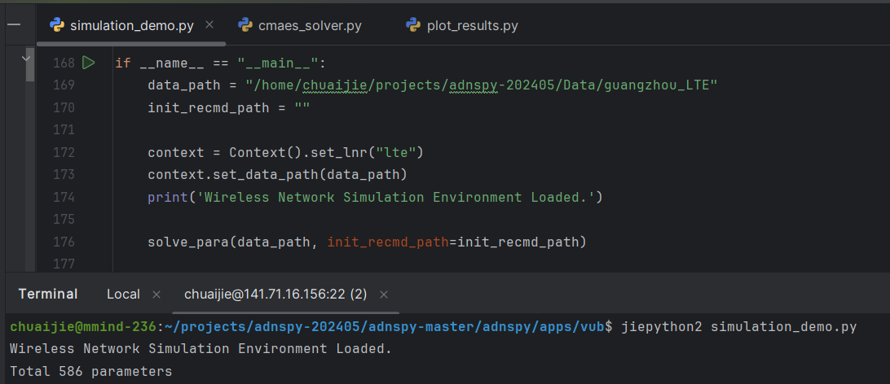

3. 加载进化算法CMA-ES，在前述无线网络仿真环境上进行迭代优化，运行1000轮，并记录算法在每一轮迭代所获取的网络仿真性能值；

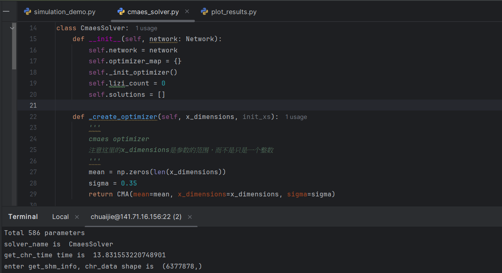

​	迭代0仿真器输出：

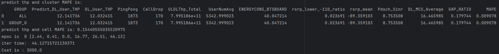

​	迭代999仿真器输出：

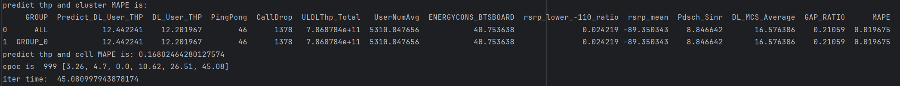

4. 加载本课题所提出的因子图分割优化方法，在前述无线网络仿真环境上进行迭代优化，运行1000轮，并记录算法在每一轮迭代所获取的网络仿真性能值；

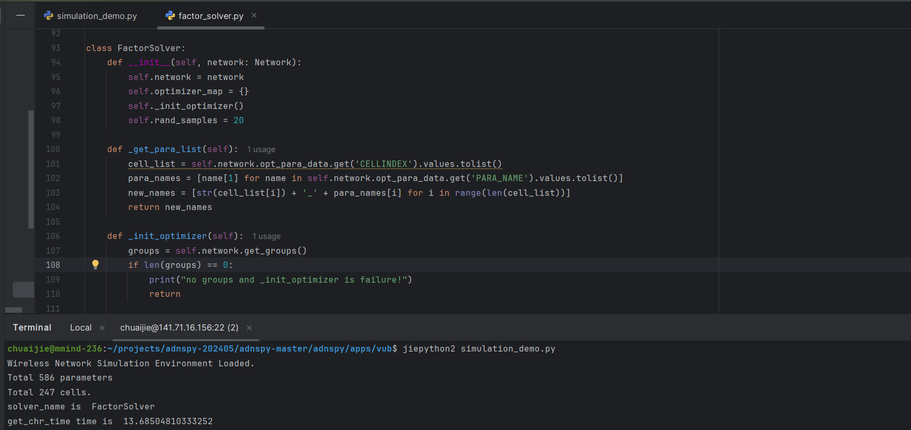

​	迭代0仿真器输出：

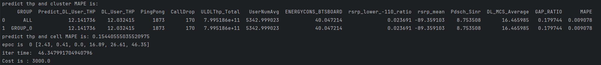

​	迭代999仿真器输出：

5. 上每个算法各运行1次，分别计算进化算法CMA-ES和本课题所提出的因子图分割优化方法的收敛速度V_old和V_new；

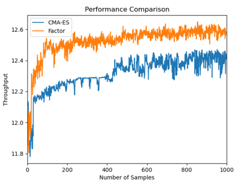

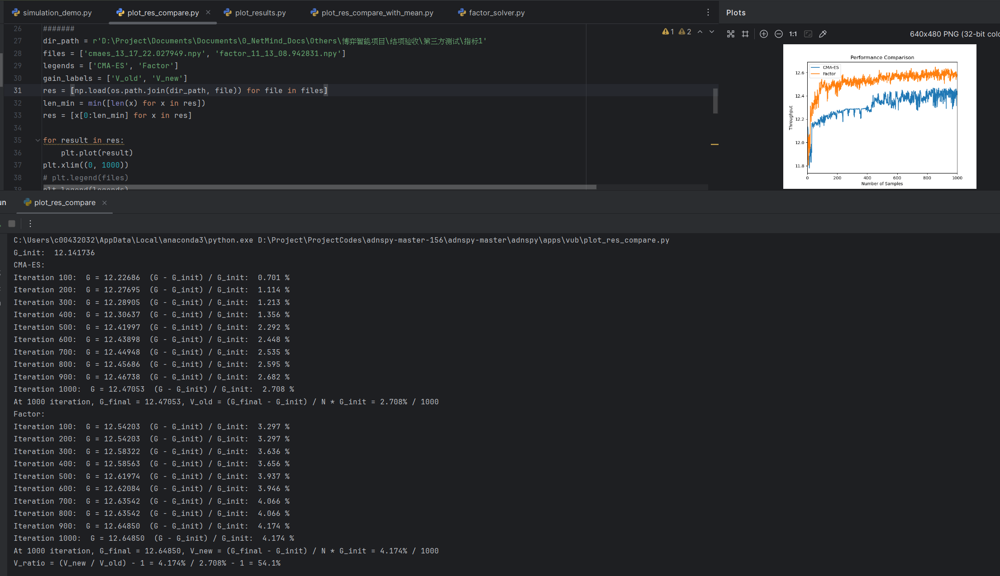

​	测试输出：V_old = 2.708% / 1000; V_new = 4.174% / 1000

6. 计算因子图分割优化方法的收敛速度提升百分比V_ratio；

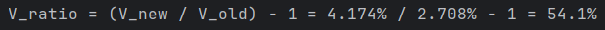

# 指标2测试流程

1. 配置一台主机，设置无线网络仿真环境，启动该环境；

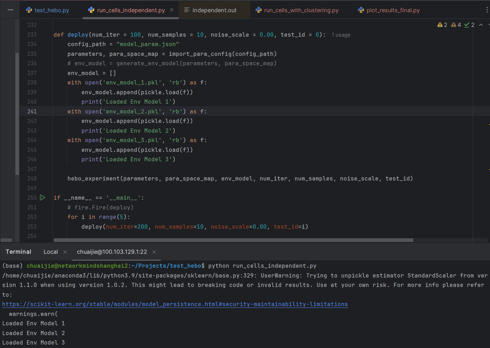

2. 加载基线算法（单小区贝叶斯优化BO），在前述网络仿真环境上进行迭代优化，并运行N=200轮，记录算法在每一轮迭代所获取的网络仿真性能值，得到性能变化曲线；

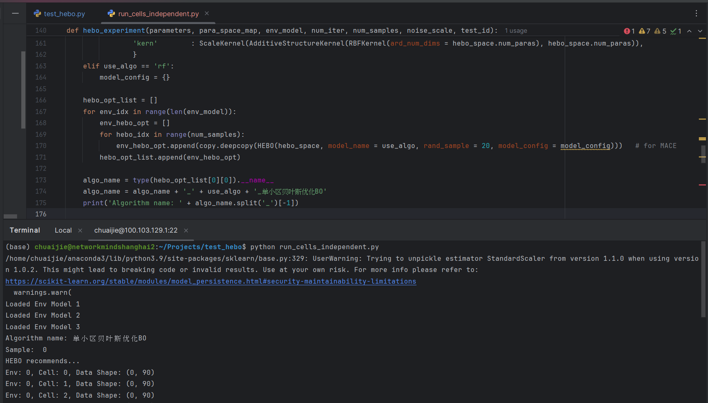

​	迭代0仿真器输出：

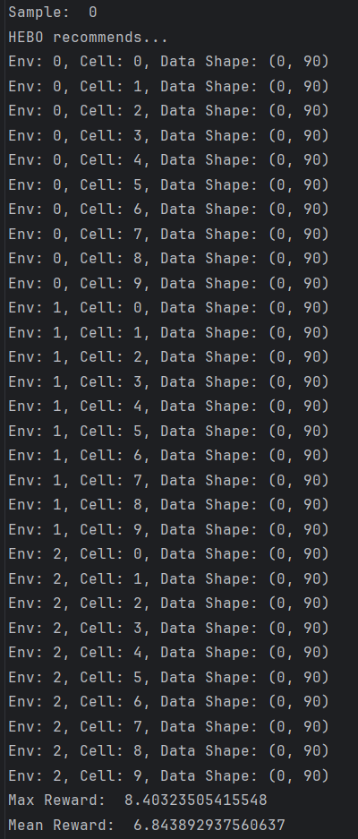

​	迭代199仿真器输出：

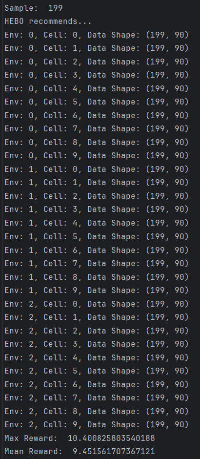

​	输出单次运行性能变化曲线：

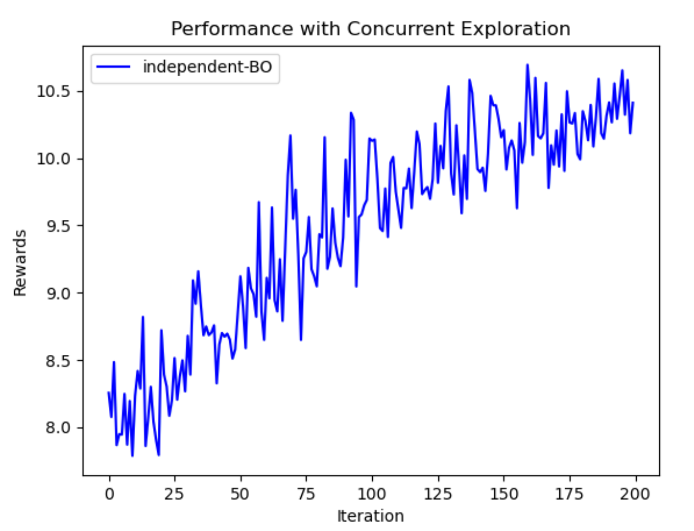

3. 加载本课题所提出的多场景多目标并发探索策略，在前述无线网络仿真环境上进行迭代优化，并运行N=200轮。记录算法所输出的无线小区相似度矩阵和小区聚类结果，以及算法在每一轮迭代所获取的网络仿真性能值，得到性能变化曲线；

​	无线小区相似度矩阵：

​	小区聚类结果：

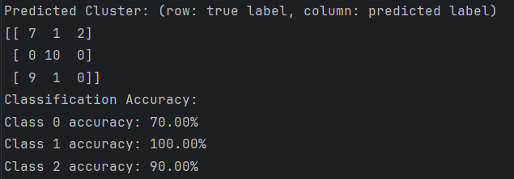

​	迭代0仿真器输出：

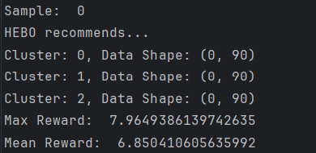

​	迭代199仿真器输出：

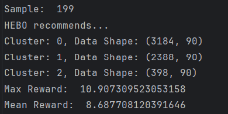

​	输出单次运行性能变化曲线：

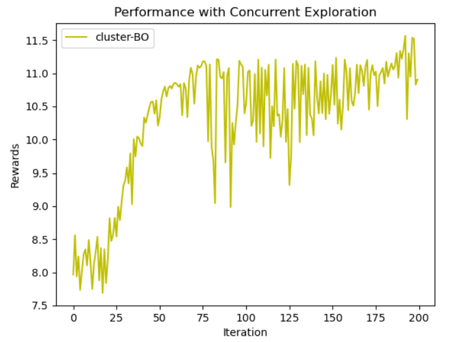

4. 每个算法重复运行5次，计算多次实验网络仿真性能曲线的平均值；

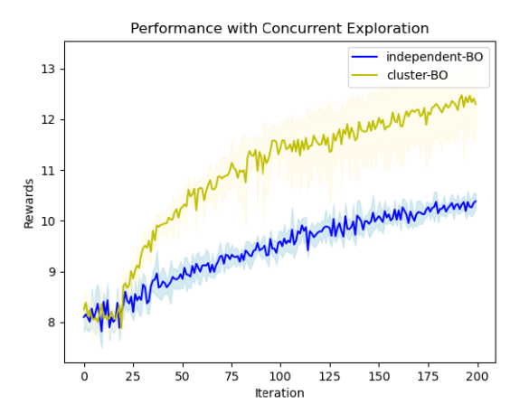

5. 计算基线算法的收敛速度V_base和待测算法的收敛速度V_new。

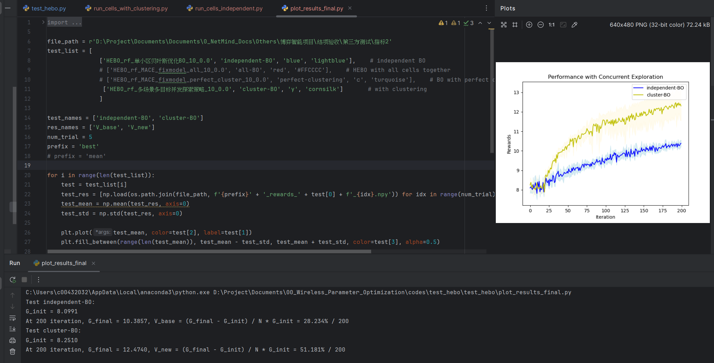

​	测试输出：V_old = 28.234% / 200; V_new = 51.181% / 200